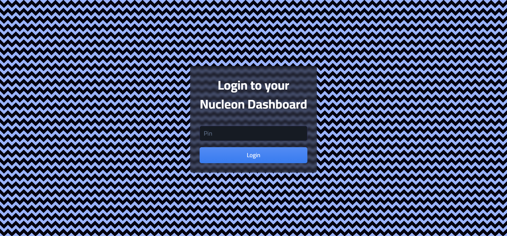
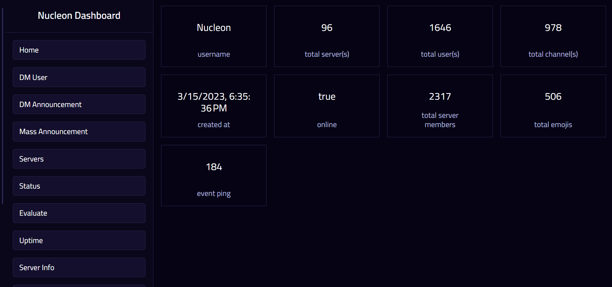
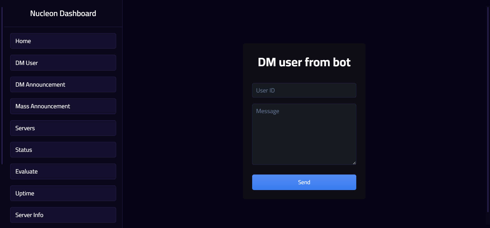

<!-- <p align="center"></p> -->


<p align="center">Multi-purpose Revolt bot with memes, images, fun, economy and more!</p>

<p align="center"><a href="https://www.patreon.com/axorax">▣ Donate ▣</a></p>

<p align="center"> • Self-host instructions below • </p>

## Overview

1. [Features](https://github.com/Axorax/nucleon-revolt-bot#features)
1. [GUI Preview Images](https://github.com/Axorax/nucleon-revolt-bot#gui-preview-images)
1. [Self-host](https://github.com/Axorax/nucleon-revolt-bot#self-host)
1. [Self-host on Replit](https://github.com/Axorax/nucleon-revolt-bot#self-host-on-replit)
1. [Keep alive](https://github.com/Axorax/nucleon-revolt-bot#keep-alive)
1. [Credentials](https://github.com/Axorax/nucleon-revolt-bot#credentials)
1. [Pin](https://github.com/Axorax/nucleon-revolt-bot#pin)
1. [Configurations](https://github.com/Axorax/nucleon-revolt-bot#configurations)
1. [APIs in use](https://github.com/Axorax/nucleon-revolt-bot#apis-in-use)

## Features

- Graphical User Interface (GUI)
- Economy
- Image manipulation
- Mass announcements, DM announcements, etc. from GUI
- Secure pin to access GUI
- Many configuration options in `config.json`
- URL shortening
- Math solve
- QR code generation
- Search users, reddit, chess.com, web, server, etc.
- Plenty of fun commands!
- Moderation commands like kick, ban, etc.
- Unique moderation commands like role-hide, role-color, etc.
- User caching
- Lockdown mode
- and many more!

## GUI Preview Images





## Self-host

1. Fork the repository
1. Clone it onto your computer
1. Put credentials in `ìndex.js` as described below
1. Change configurations if needed
1. In the terminal type, `npm i`
1. then type, `node index.js`

## Self-host on Replit

Follow the above process. If you get any errors with something related to like `libuuid` then follow these steps:

1. Click on the three dots and click "Show hidden files"
1. Go to the `replit.nix` file
1. Under `deps`, add `pkgs.libuuid`
1. In a new line, add `env = { LD_LIBRARY_PATH = pkgs.lib.makeLibraryPath [pkgs.libuuid];  }; `

**Finally, it should look something like this:**

```nix
{ pkgs }: {
  deps = [
    pkgs.nodejs-18_x
    pkgs.nodePackages.typescript-language-server
    pkgs.yarn
    pkgs.replitPackages.jest
    pkgs.libuuid
  ];
  env = { LD_LIBRARY_PATH = pkgs.lib.makeLibraryPath [pkgs.libuuid];  };
}
```

[_Self-host on Replit Credit_](https://github.com/Automattic/node-canvas/issues/1893#issuecomment-1096988007)

## Keep alive

If you want to keep your bot running all the time on Replit, you need to ping it within an interval of time. To do this, you usually need to set a URL to ping. We recommend using the `/alive` route for it. So, for Replit it would be `https://nucleon-bot.username.repl.co/alive`

## Credentials

The bot needs some credentials like the token to start working properly. You can add the credentials in the `index.js` file. In the `index.js` file near the start you should see:

```js
// ==== CREDENTIALS

CREDS_MONGODB = "";
CREDS_TOKEN = "";
CREDS_WEBHOOK = "";

// ==== END
```

Change the values for the above variables.

A list of credentials needed are:

| Credential          | Type   | Required | Variable name   |
| ------------------- | ------ | -------- | --------------- |
| Token               | String | Yes      | `CREDS_TOKEN`   |
| MongoDB URL         | String | No       | `CREDS_MONGODB` |
| Discord Webhook URL | String | No       | `CREDS_WEBHOOK` |

### ▸ Token

This is the most important credential. Without it, the bot won't work.

### ▸ MongoDB URL

**Options:** `[MONGODB_URL, "skip"]`

This is for the database. You can set the value to `skip` to not use this. But then the economy commands won't work. To make the economy commands work you need to provide a mongodb url like

```
mongodb://[username:password@]host1[:port1][,...hostN[:portN]][/[defaultauthdb][?options]]
```

[_Connection String_](https://www.mongodb.com/docs/manual/reference/connection-string/)

### ▸ Discord Webhook URL

**Options:** `[WEBHOOK_URL, "skip", "local"]`

This is also optional. It is used for logging information like user messages and reporting crashes. You can set it to `skip` to not log any information (if you don't want to log user messages only then do it from the `config.json` file). You can also set it to `local`, this will create a local file and store the information there. You can also send info by a Discord webhook.

## Pin

Pin is like a password. It is required to login to the GUI. Never share the pin with others. From the GUI, a lot of sensitive actions can be done like mass announcements, dm announcements, clearing database, etc. The length of the pin can be changed from the `config.json`. You can also make it so the pin is changed after a certain time.

## Configurations

To change configurations, go to the `config.json` file in the root directory.

All options are described below:

### ▸ Example configuration

```json
{
  "PREFIX": "?",
  "LOCAL_DATA_FILENAME": "logs.txt",
  "LOG_ERRORS_IN_CONSOLE": true,
  "EXIT_ON_ERROR": false,
  "STORE_USER_MESSAGES": false,
  "SERVER_PIN_LENGTH": 20,
  "CHANGE_PIN_INTERVAL": false,
  "REPORT_EXCEPTION": false,
  "SHOW_PIN_IN_CONSOLE": true,
  "CACHE_AND_STORE_INTERVAL": 3999999,
  "OPEN_GUI_ON_START": true,
  "STATUS_INTERVAL": 20000,
  "STATUS_LIST": [
    {
      "text":"?help | Ping me for help!",
      "presence": "Online"
    },
    {
      "text": "?help | patreon.com/axorax",
      "presence": "Busy"
    }
  ],
  "FORMAT_AUTOGENERATED_HELP_MESSAGE": false,
  "HELP_NOTICE": "\n[[ Your name here for donating ($4+) ]](https://www.patreon.com/axorax)\n",
  "HELP": {...}
}
```

### ▸ `"PREFIX"`

**Options:** `String`

This is the prefix for the bot. It is basically what the message needs to start with to be considered as a command.

```
?cowsay Hello! How are you?
```

In the above message, `?` is the prefix and the command is `cowsay`

### ▸ `"LOCAL_DATA_FILENAME"`

**Options:** `String`

If your `Discord Webhook URL` credential is set to `local` then it will create a local file to store logs. You can set the local file name from this key.

### ▸ `"HELP"`

**Options:** `{{}}`

Data for the help command.

### ▸ `"STATUS_INTERVAL"`

The interval at which the status changes in milliseconds. If you want one status only then set the value for `"STATUS_LIST"` to just one dictionary. There is no need to touch this variable then.

### ▸ `"STATUS_LIST"`

**Options:** `[{}]`

List of statuses. If either this or `"STATUS_INTERVAL"` is set to `false` then the status won't be changed at all. If you just want one status then set the value to just one dictionary like

```json
  "STATUS_LIST": [
    {
      "text":"Hey there!",
      "presence": "Busy"
    }
  ],
```

### ▸ `"LOG_ERRORS_IN_CONSOLE"`

**Options:** `true, false`

If you want to log errors in the console or not.

### ▸ `"HELP_NOTICE"`

**Options:** `String`

Text to display above help command in the embed.

### ▸ `"EXIT_ON_ERROR"`

**Options:** `true, false`

If you want the script to end on any errors.

### ▸ `"STORE_USER_MESSAGES"`

**Options:** `true, false`

If you want to store all user messages or not.

### ▸ `"SERVER_PIN_LENGTH"`

**Options:** `number`

Pin length for the server.

### ▸ `"CHANGE_PIN_INTERVAL"`

**Options:** `number, false`

The interval at which the pin changes in milliseconds. If set to `false` then the pin won't change at all. But changing the pin is good for security purposes. The changed pin will be shown in the console unless `"SHOW_PIN_IN_CONSOLE"` is set to `false`. It is recommended to set `"CHANGE_PIN_INTERVAL"` to `4.32e+8` which is equal to 5 days.

### ▸ `"REPORT_EXCEPTION"`

**Options:** `true, false`

Report exceptions or not. This uses the Webhook URL credential. Local, skip, Discord webhook URL all work.

### ▸ `"FORMAT_AUTOGENERATED_HELP_MESSAGE"`

**Options:** `true, false`

If you want to format the auto generated help message or not. Not formatting it saves more storage.

### ▸ `"SHOW_PIN_IN_CONSOLE"`

**Options:** `true, false`

If you want the pin to be shown in the console. This is useful if your hosting using a service which shows console logs and stuff. This also makes you unable to see the pin!

### ▸ `"CACHE_AND_STORE_INTERVAL"`

**Options:** `Number`

Interval at which caching users and storing messages is done in milliseconds.

### ▸ `"OPEN_GUI_ON_START"`

**Options:** `true, false`

If you want the GUI to open when starting the app or not.

## APIs in use

| API Name          | Function      |
| ----------------- | ------------- |
| gotiny            | url shorten   |
| isgd              | url shorten   |
| vgd               | url shorten   |
| qrserver          | QR code       |
| reddit            | Reddit posts  |
| icons8            | icons8 images |
| mcsrvstat, mc-api | mcip          |
| minotar           | mcskin        |
| meme-api          | memes         |
| waifupics         | waifu images  |
| joke.deno         | jokes         |
| websitecarbon     | site carbon   |

---

[Support me on Patreon](https:/www.patreon.com/axorax) —
[Check out my socials](https://github.com/axorax/socials)
